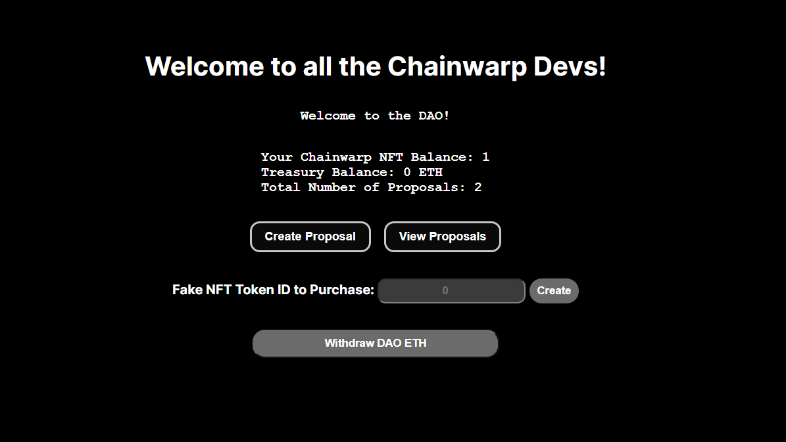

<h1 align = "center">
  <a href="https://chainwarp-web3-dao.vercel.app/"> On-chain Decentralized Autonomous Organisation </a> ⛓
</h1>



<hr>

Link to website: https://chain-warp-dao.vercel.app/

<br> 

## How to get a ChainWarpDevs NFT to become a member of DAO

Go to this link: https://sepolia.etherscan.io/address/0xdB34Cbbcf8a9fBCe95b38b3E1ea7cf63cfd90Fd7#writeContract
and connect your wallet, and then click on `Mint` function to mint your membership NFT. 
Once minted, you become a part of DAO.

<hr>
<br>

## Tech Stack Used👨‍💻

- Reactjs: Refer to https://react.dev/ install React
- Solidity: Refer to Solidity [docs](https://soliditylang.org/)
- Hardhat: Refer to Hardhat [docs](https://hardhat.org/)
- EtherJs: Refer to EtherJs [docs](https://docs.ethers.org/v5/)
- Metamask: Metamask is a browser extension that allows users to interact with the Ethereum blockchain. It allows users to connect to the Ethereum network and interact with smart contracts.

<br>
<hr>

# Prerequisites 👨‍💻

<b> Install Node JS. Refer to https://nodejs.org/en/ to install nodejs </b>


<b> Clone the project into local. </b>

```bash
git clone https://github.com/Harshkumar62367/WarptoWeb3-DAO.git
```
<b> Go into the `hardhat` folder as well as in the `frontend` folder and type the following command to install all npm packages </b>

```bash
npm install
```

And Type the following command in the `frontend` folder of the project

```bash
npm run dev
```

The Client Runs on [http://localhost:3000/](http://localhost:3000/)<br>

<b> To deploy new smart contracts, create a `.env` file in `hardhat` folder and paste these following information</b>

```bash
PRIVATE_KEY="..."
RPC_URL="..."
ETHERSCAN_API_KEY="..."
```

<b> To change the UI of the dapp, go to the frontend/pages folder, and make changes in the files according to your needs.</b>


